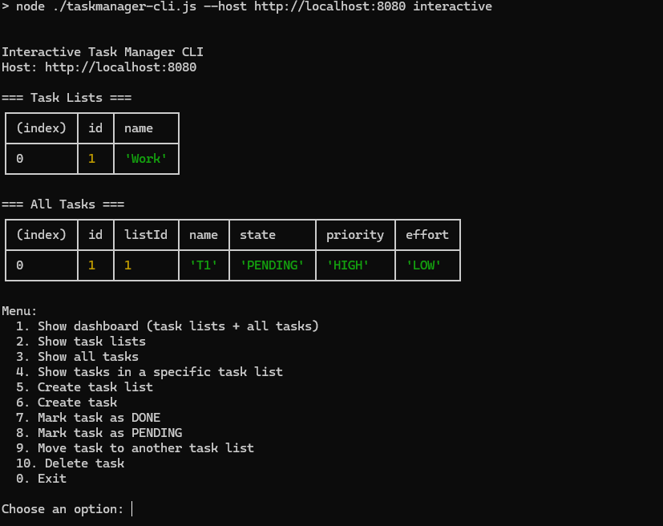

# Task Manager API

## 📌 Overview

Task Manager is a Spring Boot REST API for managing Task Lists and Tasks.

The application supports:

- Creating task lists
- Creating tasks
- Changing task status (PENDING / DONE)
- Moving tasks between lists
- Deleting tasks
- Filtering tasks by priority and effort
- Sorting tasks by priority and effort

This implementation follows the API contract defined in the assignment PDF and is compatible with the provided CLI tool.

---

## 🛠 Technology Stack

- Java 17+
- Spring Boot 3.x
- Spring Data JPA
- Maven
- H2 (in-memory database for development/testing)
- JUnit 5
- MockMvc

---

## 📂 Project Structure

```
src/main/java
 ├── controller
 ├── service
 ├── repository
 ├── entity
 ├── dto
 ├── exception
 └── specification
```

Layered architecture is used:
- Controller → Handles HTTP requests
- Service → Business logic
- Repository → Database interaction
- Specification → Dynamic filtering logic
- Exception Handler → Centralized error handling

---

## ▶ How to Run the Application

### Option 1: Run using Maven

```bash
mvn clean install
mvn spring-boot:run
```

Application starts at:

```
http://localhost:8080
```

---

### Option 2: Run as Executable JAR

Build the JAR:

```bash
mvn clean package
```

Run the application:

```bash
java -jar target/taskmanager-0.0.1-SNAPSHOT.jar
```

---

## 🧪 Running Automated Tests

Run all tests:

```bash
mvn test
```

The test suite covers:

- Create task list
- Create task
- Change task state
- Move task
- Delete task
- Filter tasks
- Sort tasks

Integration tests are implemented using `@SpringBootTest` and `MockMvc`.

---

## 🔍 API Endpoints

### Task Lists

| Method | Endpoint        | Description      |
|--------|-----------------|------------------|
| POST   | /api/task-lists | Create task list |
| GET    | /api/task-lists | Get task list    |

---

### Tasks

| Method | Endpoint                      | Description                  |
|--------|-------------------------------|------------------------------|
| POST   | /api/tasks                    | Create task                  |
| PATCH  | /api/tasks/{id}/done          | Mark task as DONE            |
| PATCH  | /api/tasks/{id}/pending       | Mark task as PENDING         |
| PATCH  | /api/tasks/{id}/move/{listId} | Move task to another list    |
| GET    | /api/tasks                    | List / filter / sort tasks   |
| DELETE | /api/tasks/{id}               | Delete task                  |

---

## 🔎 Filtering & Sorting

### Query Parameters (GET /tasks)

| Parameter       | Description                         |
|----------------|-------------------------------------|
| list           | Filter by task list ID             |
| priorities     | Comma-separated priorities          |
| efforts        | Comma-separated efforts             |
| sortBy         | priority, effort                   |
| sortDirection  | asc / desc                         |

Example:

```
GET /api/tasks?list=1&priorities=HIGH&efforts=LOW&sortBy=priority,effort&sortDirection=desc
```

---

## ❗ Error Handling

All errors follow a consistent format:

```json
{
  "error": "Error message description"
}
```

Common status codes:

- 400 → Bad Request
- 404 → Resource Not Found
- 500 → Internal Server Error

Global exception handling is implemented using `@RestControllerAdvice`.

---

## 🖥 CLI Verification

After starting the application:

```bash
npm run cli -- --host http://localhost:8080 interactive
```

Use the provided CLI tool to verify functionality.


---

## 📌 Assumptions

- Task state defaults to `PENDING` when created.
- Priority and Effort are enum-based.
- Deleting a task returns HTTP 204 (No Content).
- Validation errors return HTTP 400.

---

## 📦 Build Verification Checklist

Before submission:

- ✅ `mvn clean package` runs successfully
- ✅ `mvn test` passes
- ✅ Application starts on port 8080
- ✅ CLI tool works correctly
- ✅ Error format matches contract

---

## 👤 Author

Task Manager API Implementation  
(Assignment by Kaushal Solanki)

